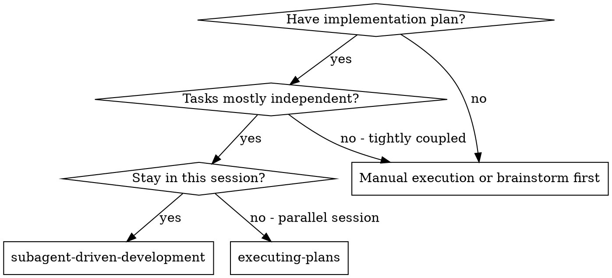
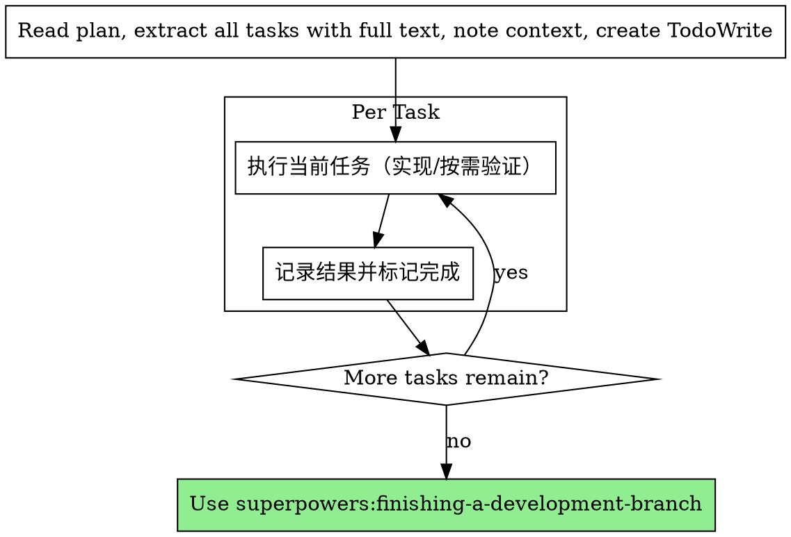

# Subagent-Driven Development

在同一会话中由单一执行者按任务顺序执行实施计划，不再派发子代理，不做自动审查。

**Core principle:** 单一执行者顺序执行任务，保持上下文一致，不做自动审查。

## When to Use



**vs. Executing Plans (parallel session):**
- Same session (no context switch)
- 单一执行者连续推进（不派发子代理）
- 不进行自动审查
- 更少流程开销

## The Process



## Prompt Templates

本模式不派发子代理，因此不使用子代理模板。

## Example Workflow

```
You: I'm using Subagent-Driven Development to execute this plan.

[Read plan file once: docs/plans/feature-plan.md]
[Extract all 5 tasks with full text and context]
[Create TodoWrite with all tasks]

Task 1: Hook installation script

[执行 Task 1，按计划实现]
[记录结果并标记 Task 1 完成]

Task 2: Recovery modes

[执行 Task 2，按计划实现]
[记录结果并标记 Task 2 完成]

...

[After all tasks]
[Use finishing-a-development-branch]
```

## Advantages

**vs. Manual execution:**
- 流程化执行但仍由单一执行者完成
- 计划驱动，避免遗漏步骤

**vs. Executing Plans:**
- 同一会话完成（无交接）
- 连续推进，无需批次等待

**Efficiency gains:**
- 无子代理调度成本
- 上下文连续，切换成本低

**Quality gates:**
- 质量把关由开发者人工审查

**Cost:**
- 更少流程成本，但质量依赖开发者人工把关

## Red Flags

**Never:**
- 脱离计划随意改动范围
- 遇到阻塞不说明原因直接推进

**If blocked:**
- 立刻停下并向开发者说明阻塞点

## Integration

**Required workflow skills:**
- **superpowers:writing-plans** - Creates the plan this skill executes
- **superpowers:finishing-a-development-branch** - Complete development after all tasks

**Subagents should use:**
- 不使用 `superpowers:test-driven-development`（本仓库禁用 TDD），按计划编写与验证测试
- 涉及 Java 读侧开发时，遵循 `skills/modelView/SKILL.md` 规范

**Alternative workflow:**
- **superpowers:executing-plans** - Use for parallel session instead of same-session execution
